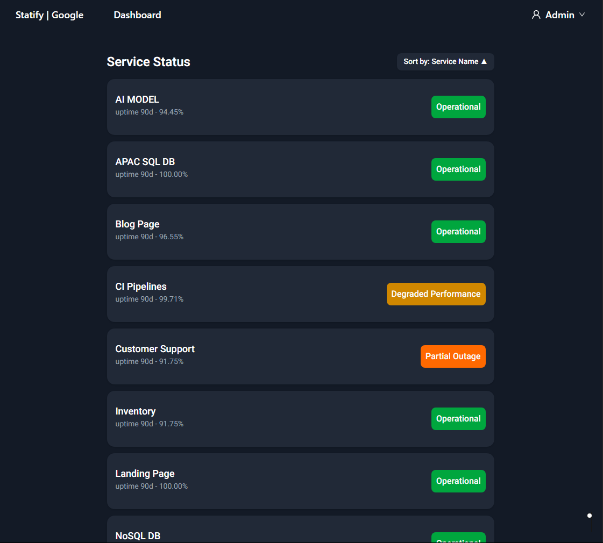
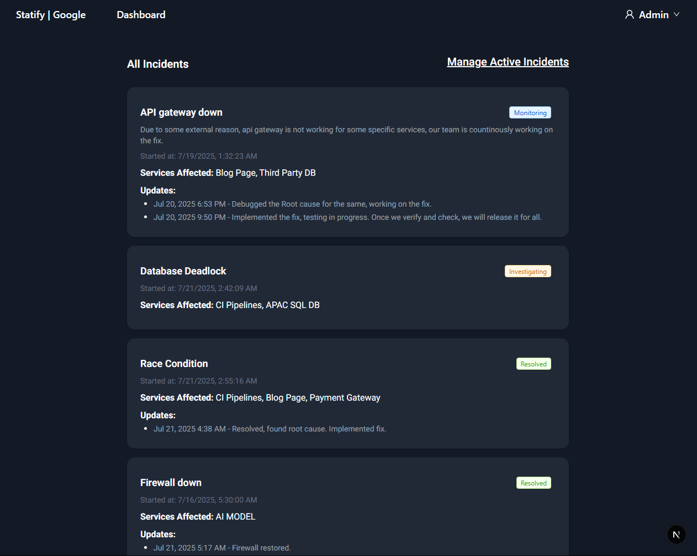

# ⚡ Statify Frontend

> Modern service status dashboard — built with Next.js, Tailwind, Redux, and TypeScript.

<p float="left">
  
  
</p>

## 🚀 Overview

Statify helps organizations transparently communicate service uptime, incidents, and maintenance windows to users. This frontend project powers the real-time dashboard and admin interface.


## ✅ Features

### Functional

- 🔐 Login/Register + token handling (JWT)
- 🛠️ Admin dashboard for managing:
  - Organizations
  - Services (CRUD)
  - Incidents & Maintenance
- 📊 Uptime visibility per service
- 🌍 Public status page
- 🔁 Real-time updates via WebSocket
- 🎨 Clean responsive UI (dark mode)

### Non-Functional

- ⚡ Fast SPA experience (Next.js App Router)
- 🧩 Modular folder structure for scale
- 🧪 Typesafe (TS + strict mode)
- 🧠 Local caching with Redux Toolkit
- 💅 Consistent UI with Tailwind + shadcn/ui
- 🌐 Axios + interceptors for secure API communication

## 🧱 Folder Structure

```

src/
├── app/ # App router + layouts + pages
├── components/ # Reusable UI components
├── constants/ # Static config and enums
├── features/ # Redux slices (auth, orgs, services)
├── hooks/ # Custom React hooks
├── lib/ # Axios config, utils
├── styles/ # Tailwind globals
├── types/ # Global TypeScript types

```

## 🛠️ Tech Stack

| Tool                  | Purpose                         |
| --------------------- | ------------------------------- |
| **Next.js**           | Frontend framework (App Router) |
| **TypeScript**        | Static typing                   |
| **Tailwind CSS**      | Utility-first styling           |
| **shadcn/ui**         | Headless UI components          |
| **Redux Toolkit**     | State management                |
| **Axios**             | HTTP requests + interceptors    |
| **ESLint + Prettier** | Linting & formatting            |

## 🧪 Dev Setup

### 1. Clone & Install

```bash
git clone https://github.com/priyans-hu/statify-frontend.git
cd statify-frontend
npm install
```

### 2. Env Setup

Create `.env.local` from template:

```env
NEXT_PUBLIC_API_BASE_URL=http://localhost:8000
NEXT_PUBLIC_WEBSOCKET_URL=http://localhost:8000/ws
```

### 3. Run Dev Server

```bash
npm run dev
```

Visit [http://localhost:3000](http://localhost:3000)

---

## 🧭 Usage Guide

| Page                                     | Path                   |
| ---------------------------------------- | ---------------------- |
| 📋 Service List                          | `/{org}/dashboard`     |
| 🆕 Create Incident                       | `/{org}/incidents`     |
| 🆕 Incident history                      | `/{org}/incidents/all` |
| 🌐 Public Status Page + Active indidents | `/{org}/status`        |

---

## 🧠 Architecture

- App Router layout with separate `dashboard` and `public` views
- Redux slices for: `auth`, `org`, `services`, `incidents`
- Axios wrapper in `lib/api.ts` handles token injection & error handling
- `hooks/useAuth`, `useOrg`, `useService` abstract logic from UI
- Data displayed using `shadcn/ui` components + icon system
- Dark mode enabled via Tailwind + `class` strategy

## 🧰 Scripts

```bash
npm run dev         # Start dev server
npm run build       # Production build
npm run eslint      # Run ESLint
npm run format      # Prettify code
```

## 📦 Deployment Notes

Deploy via:

- **Vercel** (recommended)
- **Netlify**
- **Render static site (if decoupled)**

Ensure `NEXT_PUBLIC_API_BASE_URL` & `NEXT_PUBLIC_WEBSOCKET_URL` is configured with backend URL.
